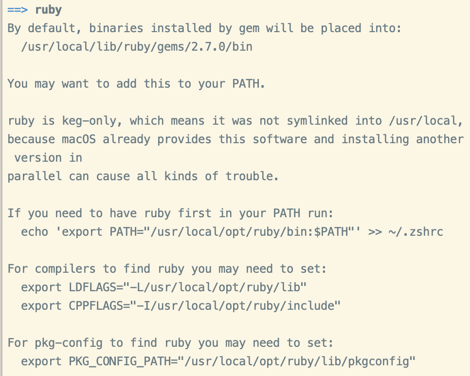

##### 2、安装RVM

Ruby版本管理器,包括Ruby的版本管理和Gem库管理
 用于安装Ruby环境，可以管理多个Ruby环境、依赖的第三方Ruby插件等都由RVM管理。

RVM  是RVM的版本管理器  类似于Node环境的
 NVM Node环境版本管理器

2.1 开始安装 RVM
curl -L [https://get.rvm.io](https://links.jianshu.com/go?to=https%3A%2F%2Fget.rvm.io) | bash -s stable

RVM的安装路径：~/.rvm/scripts/rvm

> 2.2 载入RVM环境
> source ~/.rvm/scripts/rvm


### 2、安装Ruby

##### 方式一：homebrew安装Ruby

> 安装ruby
>  brew install ruby

##### 方式二：用 RVM 安装 Ruby 环境

安装指定版本

> rvm install 版本

安装最新版本

> rvm install ruby --head


```
brew install ruby 

==> ruby
By default, binaries installed by gem will be placed into:
  /usr/local/lib/ruby/gems/2.7.0/bin

You may want to add this to your PATH.

ruby is keg-only, which means it was not symlinked into /usr/local,
because macOS already provides this software and installing another version in
parallel can cause all kinds of trouble.

If you need to have ruby first in your PATH run:
  echo 'export PATH="/usr/local/opt/ruby/bin:$PATH"' >> ~/.zshrc

For compilers to find ruby you may need to set:
  export LDFLAGS="-L/usr/local/opt/ruby/lib"
  export CPPFLAGS="-I/usr/local/opt/ruby/include"

For pkg-config to find ruby you may need to set:
  export PKG_CONFIG_PATH="/usr/local/opt/ruby/lib/pkgconfig"
```





#### 3、安装Ruby完成使用

安装完成以后，Ruby, Ruby Gems 都已经安装

RubyGems：是Ruby的一个包管理器，提供了分发Ruby程序和函式库的标准格式“gem”，旨在方便地管理gem安装的工具，以及用于分发gem的服务器。从Ruby 1.9版起成为Ruby标准库的一部分。类似于Python的pip。

> gem sources -l

> gem source -r [https://rubygems.org/](https://links.jianshu.com/go?to=https%3A%2F%2Frubygems.org%2F)
> gem source -a [https://gems.ruby-china.org](https://links.jianshu.com/go?to=https%3A%2F%2Fgems.ruby-china.org)


4、ruby 安装插件

> gem install

xxxx --help
比如 gem -- help