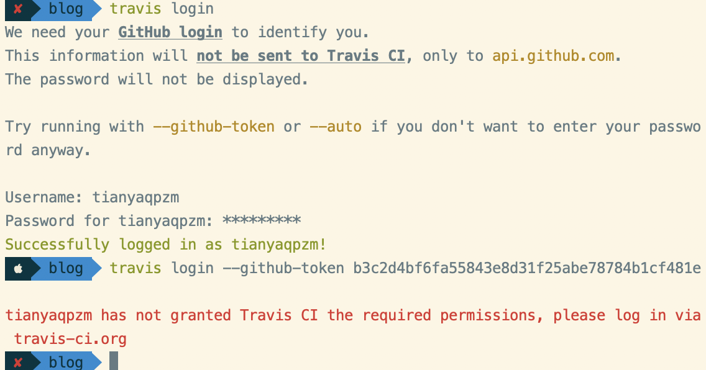

#### 1. GitHub 建立

#### 2. 本地安装 hexo

##### Create a new post

```bash
$ hexo new "My New Post"
```

More info: [Writing](https://hexo.io/docs/writing.html)

##### Run server

```bash
$ hexo server
```

More info: [Server](https://hexo.io/docs/server.html)

##### Generate static files

```bash
$ hexo generate
```

More info: [Generating](https://hexo.io/docs/generating.html)

##### Deploy to remote sites

```bash
$ hexo deploy
```

More info: [Deployment](


#### 3. 主题

#### 4. trivas 自动部署 hexo 的 blog

```
Travis_Token  :  f093d9acb49cc127430aeed *************************26a3f890b

travis encrypt 'Travis_Token=f093d9acb49cc127430aeed *************************26a3f890b' --add


echo 'Travis_Token=f093d9acb49cc127430aeed *************************26a3f890b' > ~/.ssh/Travis_Token

0

git push --force --quiet "https://f093d9acb49cc127430aeed *************************26a3f890b@github.com/tianyaqpzm/tianyaqpzm.github.io.git" hexo
```



- token 登录

> 登陆 `GitHub` –`Settings` 选项，找到 `Personal access tokens` 页面。
>
> 点击右上角的 `Generate new token` 按钮会生成新的 token，点击后提示输入密码后继续，然后来到如下界面，取个名字（我这里取 `Travis_Token` 下面的配置文件中会用到)，勾选相应权限，这里只需要 `repo` 下全部和 `user` 下的 `user:email` 即可。

```
travis encrypt 'GH_TOKEN=<TOKEN>' --add


```

- id_rsa 登录 (失败)

> 参考 [Travis CI 系列：自动化部署博客](https://cosmeapp.github.io/2017/09/18/travis-ci-auto-build/)


在`.travis.yml`添加`ssh -T git@github.com`测试，发现 ssh 的配置是没问题的。

- 密码账号登录

#### 问题

1. 解决 master commit 树被清空

两种方案：

- 在 public 文件夹里 git init
- 将 clone 下的.git 文件夹 移动到 public 下面： mv ./blog/.git/ ./public/

2. 使用 token 进行提交

可以先在本地进行验证，

```
git push --force --quiet "https://f093d9cb49cc127****f2026a3f890b@github.com/tianyaqpzm/tianyaqpzm.github.io.git" hexo
```

3. Travis 部署时报错：WARN No layout: categories/index.html

主题也是一个版本库，目录下包含.git 目录，当向 github 进行 push 时，未 push 上去。目前的解决方案时将主题目录下的.git 改名或者删除，如果再 push 发现还是没有提交上去。然后将主题目录拷贝到库之外的目录，执行 push 在服务端先删除主题目录，然后再把主题拷贝回来，再次 push。
